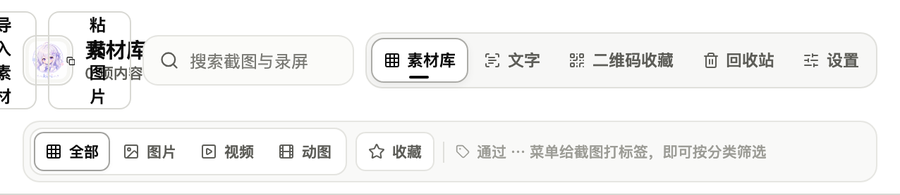
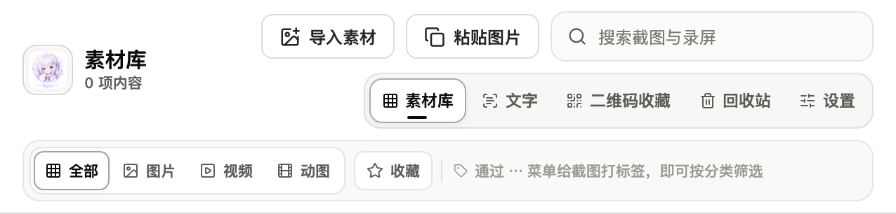
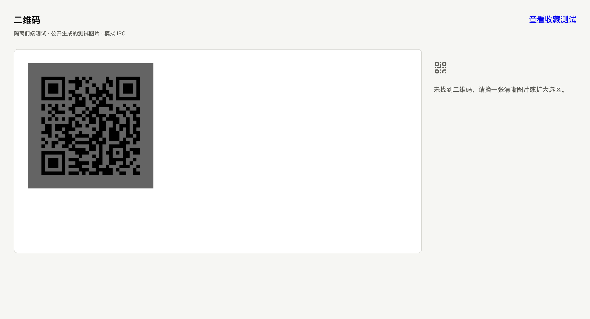
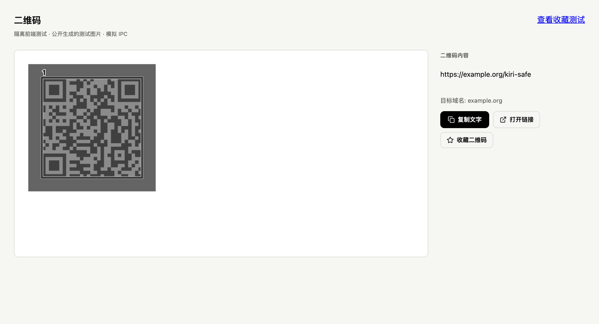

# 素材库窄窗口与二维码漏识别：本轮收尾

2026-10-01。基线为 `a24ad35c3d7781bcb1ab65ca07623b688363c6e5`。
当前正式路径安装版仍是该基线的 Mac arm64 1.6.6 签名验收 app；本轮没有重装或抢占原生 GUI。
本目录只含公开生成图片、空测试素材库和隔离组件证据，无用户截图、素材或二维码内容。

## 素材库：完整控件换行

导入、粘贴不再被压成逐字换行；搜索、导航与筛选按剩余宽度换行，图标保留尺寸。
英文和日文的收藏按钮也不会被窄窗口裁掉。未改按钮行为或本地素材。

| Before：原 CSS | After：本轮 CSS |
| --- | --- |
|  |  |

同一个实际 React `LibraryWindow`，638×700 CSS viewport、DPR 2、中文、空测试素材库、Chromium headless；
截图只截完整 header，因控件换行高度不同，原图高度不同。Before 载入基线完整 CSS，After 载入本轮 CSS，
组件和其余样式相同。IPC 为隔离模拟；这些不是 Mac WebView、Windows 或 Linux 原生截图。

`library-layout-results.json`：中/英/日 × 320/360/638/800/1024/1512 CSS 宽度，
另按 800/1512 的 125/150/200% 比例缩小可用 CSS 宽度，共 36 条边界记录，全部通过。
实际测量每个 header 按钮/输入框边界和中心命中目标，导入/粘贴文字不换行；无 page error。
三语分别鼠标导入、键盘 Enter 粘贴，模拟 IPC 只各触发一次。
这是响应式空间模拟，未宣称原生 DPI 或实体混合 DPI 通过。

复验：`pnpm exec vite --config scripts/qa/library-harness.vite.ts`，
打开 `/scripts/qa/library-harness.html?language=zh-Hans`（同样支持 en / ja）。
调整到上述宽度，确认导入/粘贴、完整搜索框、五个导航项、四个种类筛选及收藏可达；
单击导入、聚焦粘贴按 Enter，可从隔离页 `window.__qaActions` 核对。
结束后关闭该测试页及 Vite。宽屏与日文原图也保留在本目录。

## 二维码：空结果后的有限阈值重试

整图自动阈值可能吞掉局部低对比度二维码。默认结果为空时，最多重试 64/128/192 三档阈值，
找到可读结果即停止；不缩放原图，不改变坐标，不替换已经定位到码的默认结果。

| Before：真实旧解码结果，0 个 | After：真实新解码结果，1 个 |
| --- | --- |
|  |  |

输入是同一 `src-tauri/tests/fixtures/qr/contrast.png`：960×480，公开生成的
`https://example.org/kiri-safe` 码，黑/白映射为 0/100，放在白色画布上。
图片来自本地生成器，不是用户提供的码。旧/新生产 Rust 解码器分别实测 0/1 个码；
JSON 元数据保存为 contrast-before.json / contrast.json，由实际 `QrResults` 渲染。
两图为相同 1200×650 CSS viewport、DPR 2、中文的浏览器组件展示，IPC 模拟；
不冒充原生扫描过程。没有打开 URL、复制或收藏操作。

复现图：`pnpm exec vite --config scripts/qa/qr-harness.vite.ts`，
打开 `/scripts/qa/qr-harness.html?scenario=contrast&language=zh-Hans`；
加 `&before=1` 展示旧解码结果。

本地直接编译生产 QR 模块并运行 6 个测试全部通过（复用已有依赖，无全量 Cargo 构建）。
新增覆盖三档局部对比度、两处相同内容码及其原坐标、纯色无伪码；保留单/多码、Unicode、
损坏码和危险协议规则回归。整应用 Rust test/check 由本次远程 CI 验证，精确 run 见 PR。
前端 build 与 188 个 Node 回归通过。

**用户原生问题尚未验收通过：** 用户截图中裁出的弹窗小预览由旧解码器 0 变成新解码器 1；
但是截图已有弹窗缩放、背景变暗与遮挡，不等于原生传入 PNG。被遮挡的背景区域仍为 0。
必须用弹窗出现前的原始选区 PNG 或用户在新包重试，才能确认其实际场景；不上传原截图或码内容。
没有声称重建被覆盖的定位点，或所有低对比度/损坏码都能恢复。

## 交接边界

本轮只处理上述两项反馈，继续集中在 PR #71；不合并、不发版、不新增下一批任务。
保留现有固定路径安装版和原 app 回滚副本，不自动安装后台修复。
Mac/Windows/Linux 原生新包、真实 IME、物理混合 DPI/热插拔仍按 PR 原矩阵标待验。
